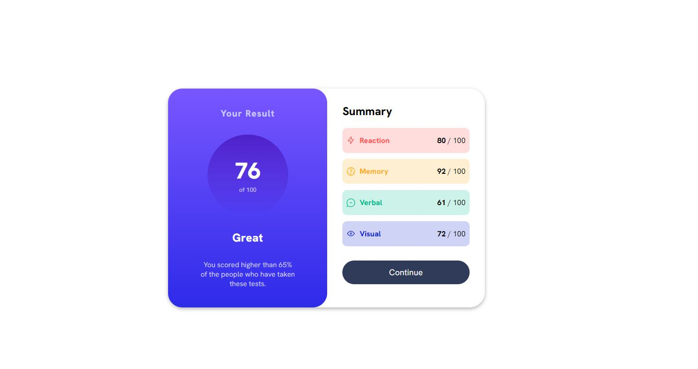

# Frontend Mentor - Results Summary Component Solution

This is a solution to the [Results summary component challenge on Frontend Mentor](https://www.frontendmentor.io/challenges/results-summary-component-CE_K6s0maV). Frontend Mentor challenges help you improve your coding skills by building realistic projects. 

## Table of contents

- [Overview](#overview)
  - [The challenge](#the-challenge)
  - [Screenshot](#screenshot)
  - [Links](#links)
  - [Built with](#built-with)
  - [What I learned](#what-i-learned)
  - [Continued development](#continued-development)
  - [Useful resources](#useful-resources)
- [Author](#author)


## Overview

### The challenge

Users should be able to:

- View the optimal layout for the interface depending on their device's screen size
- See hover and focus states for all interactive elements on the page
- **Bonus**: Use the local JSON data to dynamically populate the content

### Screenshot




### Links

- Solution URL: [Frontend Mentor](https://www.frontendmentor.io/solutions/results-summary-component-solution-vixMGimf_L)
- Live Site URL: [Handled by Github](https://clipzorama.github.io/Result-Summary-Component-Solution-F.M/)

## My process

### Built with

- Semantic HTML5 markup
- CSS custom properties
- Flexbox


**Note: These are just examples. Delete this note and replace the list above with your own choices**

### What I learned

During this project, I worked on improving my skills in layout design using flexbox. I learned how to create responsive components that scale well on smaller screens.

I also spent time practicing custom properties for color and layout elements, which made the design consistent across the project.

```html
<div class="results">
    <h2 class="result-title">Your Result</h2>
    <div class="stats">
        <h1>76</h1>
        <p>of 100</p>
    </div>
    <b>Great</b>
    <p class="data">You scored higher than 65% of the people who have taken these tests.</p>
</div>

```

```css

.results {
    width: 60%;
    display: flex;
    justify-content: center;
    align-items: center;
    flex-direction: column;
    background-image: linear-gradient(to bottom, hsl(252, 100%, 67%, 1), hsl(241, 81%, 54%));
    border-radius: 30px;
    padding: 40px;
    gap: 2rem;
    
}
.result-title {
    font-size: 1.2rem;
    color: var(--Light-lavender);
    letter-spacing: 0.08rem;
  
}
.stats {
    width: 170px;
    height: 170px;
    display: flex;
    flex-direction: column;
    justify-content: center;
    align-items: center;
    border-radius: 50%;
    background-image: linear-gradient(to bottom, var(--Violet-blue), var(--Persian-blue));
}

```


### Continued development

In future projects, I want to:

- Explore different layout techniques beyond flexbox, such as CSS Grid and positioning strategies.

- Learn how to optimize designs for even better responsiveness across more devices.

- Focus more on accessibility improvements, ensuring that components are fully navigable and usable with screen readers.

- Implement more complex animations and transitions to enhance interactivity and user experience.


### Useful resources

- [MDN](https://developer.mozilla.org/en-US/) - This helped me for remembering CSS properties that I can use for my solution. Mdn is actually really helpful anytime I need clarification for specific CSS properties or small functionalities of code in general. The website offered me practical code examples, showing how different elements and CSS properties work in real-world scenarios. This helped me understand the flexibility of CSS code that I can add in the future.

## Author

- Frontend Mentor - [@Clipzorama](https://www.frontendmentor.io/profile/Clipzorama)


